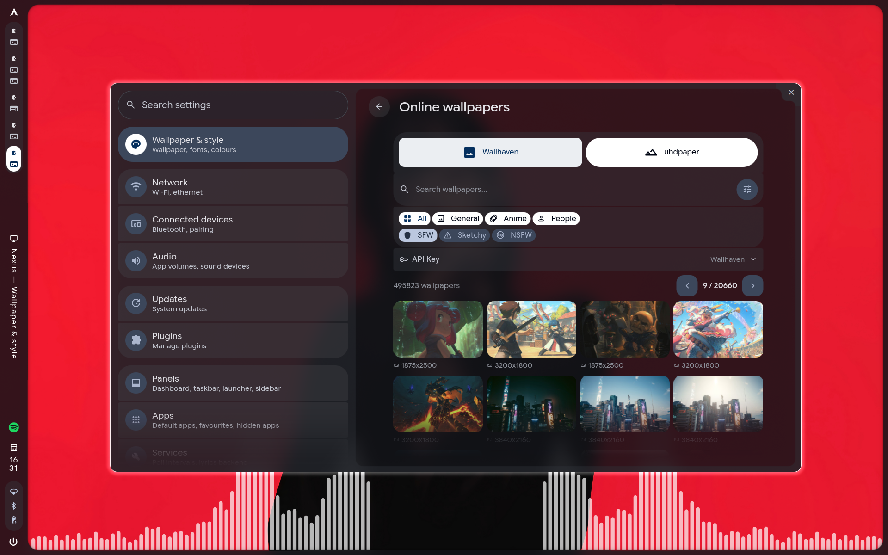

# Caelestia Web Wallpaper

Módulo de wallpapers online para [Caelestia Shell](https://github.com/user/caelestia-shell). Descarga wallpapers directamente desde **Wallhaven.cc** y **UHDPaper.com** sin salir de tu desktop.



## Características

- **Wallhaven.cc** - API completa con búsqueda, filtros, categorías, y paginación
- **UHDPaper.com** - Scraping con resoluciones 4K, 2K, 1080p
- **Interfaz QML** - Integración completa con el Nexus de Caelestia
- **Scripts CLI** - Uso desde terminal para scripting y automatización

## Antes de instalar

Se recomienda hacer un backup de tu configuración de Caelestia antes de instalar:

```bash
# Backup completo del shell
cp -r ~/.config/quickshell/caelestia ~/.config/quickshell/caelestia.bak

# Obackup solo los archivos que este script modifica
mkdir -p ~/.config/quickshell/caelestia-backup
cp ~/.config/quickshell/caelestia/services/*.qml ~/.config/quickshell/caelestia-backup/ 2>/dev/null
cp ~/.config/quickshell/caelestia/modules/nexus/PageCompRegistry.qml ~/.config/quickshell/caelestia-backup/ 2>/dev/null
cp ~/.config/quickshell/caelestia/modules/nexus/pages/wallandstyle/*.qml ~/.config/quickshell/caelestia-backup/ 2>/dev/null
```

Para restaurar el backup:
```bash
cp -r ~/.config/quickshell/caelestia.bak/* ~/.config/quickshell/caelestia/
```

## Instalación

### Rápida

```bash
git clone https://github.com/SamuzDev/caelestia-webwallpaper.git
cd caelestia-webwallpaper
./install.sh
```

### Opciones

```bash
# Forzar sobreescritura de archivos existentes
./install.sh --force

# Especificar directorio de Caelestia
# Bash/zsh:
CAELESTIA_DIR=~/.config/quickshell/caelestia ./install.sh

# Fish:
env CAELESTIA_DIR=~/.config/quickshell/caelestia ./install.sh
```

### Dependencias

- Python 3.8+
- `requests` (para Wallhaven API)
- `beautifulsoup4` y `lxml` (para UHDPaper scraping)
- `curl` (para descargas)

El script de instalación instala automáticamente las dependencias de Python.

## Estructura

```
caelestia-webwallpaper/
├── install.sh                          # Script de instalación
├── scripts/
│   ├── wallhaven/                      # CLI para Wallhaven.cc
│   │   ├── main.py                     # Entry point
│   │   └── wallhaven/                  # Paquete Python
│   │       ├── api/client.py           # Cliente API v1
│   │       ├── api/downloader.py       # Descarga batch
│   │       ├── models/                 # Dataclasses
│   │       └── utils/                  # Config y formatter
│   └── uhdpaper/                       # CLI para UHDPaper.com
│       ├── main.py                     # Entry point
│       ├── scraper.py                  # Scraping HTML
│       ├── downloader.py               # Descarga cascada
│       └── requirements.txt            # Dependencias Python
├── services/
│   ├── WallhavenService.qml            # Servicio QML Wallhaven
│   ├── UhdService.qml                  # Servicio QML UHDPaper
│   └── Wallpapers.qml                  # Servicio wallpaper local
└── modules/nexus/
    ├── PageCompRegistry.qml            # Registro de páginas
    ├── pages/wallandstyle/
    │   ├── WallpaperAndStyle.qml       # Página principal
    │   └── OnlineWallpapers.qml        # Interfaz wallpapers online
    └── common/
        └── WallItemOnline.qml          # Tarjeta de wallpaper online
```

## Uso

### Desde la interfaz

1. Abre Caelestia (Nexus → Wallpaper & style → Online)
2. Selecciona el proveedor (Wallhaven o UHDPaper)
3. Busca o navega por categorías
4. Haz clic en "Set as wallpaper" o "Download"

### Desde terminal

#### Wallhaven

```bash
# Buscar wallpapers
python3 scripts/wallhaven/main.py search "nature"

# Wallpaper random
python3 scripts/wallhaven/main.py random --download

# Descargar por ID
python3 scripts/wallhaven/main.py download abc123

# Ver info
python3 scripts/wallhaven/main.py info abc123
```

#### UHDPaper

```bash
# Listar wallpapers
python3 scripts/uhdpaper/main.py list

# Listar por categoría
python3 scripts/uhdpaper/main.py list --category anime

# Descargar
python3 scripts/uhdpaper/main.py download <slug>

# Listar categorías
python3 scripts/uhdpaper/main.py categories
```

## Configuración

### Wallhaven API Key

Para contenido NSFW necesitas una API key de Wallhaven:

1. Crea una cuenta en [wallhaven.cc](https://wallhaven.cc)
2. Ve a [Configuración de cuenta](https://wallhaven.cc/settings/account)
3. Copia tu API key
4. En Caelestia: Nexus → Wallpaper & style → Online → API Key

La key se guarda en `~/.local/state/caelestia/wallhaven.json`.

### Directorio de wallpapers

Por defecto se guardan en `~/Pictures/Wallpapers`. Puedes cambiarlo en la configuración de Caelestia:

```json
{
  "paths": {
    "wallpaperDir": "~/Imágenes/Wallpapers"
  }
}
```

## Licencia

MIT
